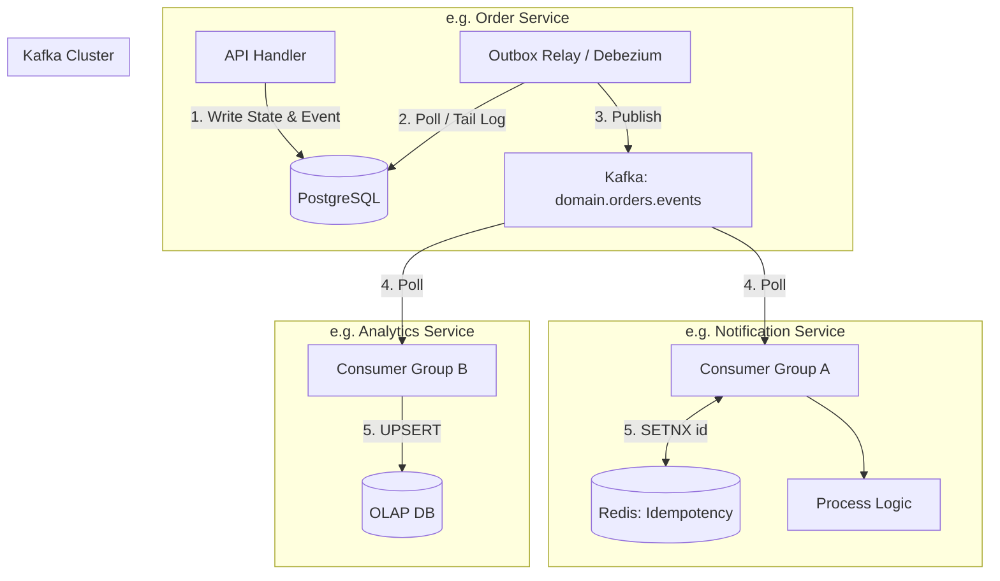

# Event Streaming Architecture (Kafka)

## 1. Overview
The Event Processing Platform utilizes **Apache Kafka** as its central nervous system. This architecture defines the standards for producing, routing, and consuming domain events to ensure high throughput, durability, and loose coupling between microservices. We have chosen Kafka over RabbitMQ specifically for its persistent log structure, which enables Event Sourcing, consumer replays, and massive horizontal scalability via partitioned topics.

## 2. Topic & Partition Strategy

### Topic Structure
Topics are strictly bounded by Domain Entities (Aggregates). We avoid grouping unrelated events into a single "firehose" topic.

- `domain.users.events`: All mutations related to the User Aggregate (e.g., `UserCreated`, `UserUpdated`).
- `domain.orders.events`: All mutations related to the Order Aggregate (e.g., `OrderCreated`, `PaymentFailed`).
- `sys.notifications.dlq`: Dead Letter Queue for failed notification processing.

### Partitioning & Ordering
- **Partition Key**: All events related to a specific aggregate MUST use the Aggregate's ID (e.g., `user_id` or `order_id`) as the Kafka message key.
- **Why?**: Kafka guarantees strict ordering of messages *within a partition*. By hashing the aggregate ID to a partition, we guarantee that all state changes for a single Order (e.g., `PENDING` -> `SHIPPED`) are consumed in the exact sequence they occurred, preventing race conditions like delivering a shipment before the payment completes.

## 3. Event Schema Design

All messages must adhere to the **CloudEvents** specification (v1.0) formatted as JSON (or Avro backed by a Schema Registry for strict typing).

```json
{
  "specversion": "1.0",
  "id": "evt_abc123789",
  "source": "/services/order-service",
  "type": "domain.orders.OrderCreated",
  "datacontenttype": "application/json",
  "time": "2026-03-07T12:00:00Z",
  "subject": "ord_987654",
  "data": {
    "userId": "usr_9cc9b6",
    "totalAmountCents": 5000,
    "items": [
      {
        "productId": "prod_a1",
        "quantity": 1
      }
    ]
  }
}
```
*Note: The `id` functions as the Global Idempotency Key for downstream consumers.*

## 4. Producer & Consumer Design

### Event Flow Architecture
The platform strictly separates the act of persisting state from broadcasting events to prevent the Dual-Write Problem.



### Producer Design (Transactional Outbox)
- Microservices MUST NOT explicitly call `kafka_producer.send()` during an HTTP request.
- **Implementation**: The service inserts the event into a local PostgreSQL `outbox_events` table within the same transaction that updates the business entity. A background CDC (Change Data Capture) tool like **Debezium** or a custom polling worker reads the outbox table and guarantees *At-Least-Once* delivery to Kafka.

### Consumer Groups
- **Logical Grouping**: Each reacting microservice defines its own unique `group.id` (e.g., `notification-service-cg`, `analytics-service-cg`). 
- **Broadcast Semantics**: Because they use different group IDs, both the Notification Service and the Analytics Service receive a copy of every `OrderCreated` event to process independently.
- **Horizontal Scaling**: If the Notification Service is lagging, K8s scales the pods. Kafka automatically rebalances the topic partitions across the new pods within the same consumer group. (Max pods = Number of topic partitions).

## 5. Idempotency & Failure Handling

### Idempotent Event Consumption
Kafka's *At-Least-Once* delivery guarantee means consumers will occasionally receive the same event twice (e.g., during consumer rebalancing).
- **Rule**: Every consumer MUST be idempotent.
- **Strategy A (Strict)**: The consumer checks the event `id` against a Redis cache (`SETNX processed:{id} 1 EX 86400`). If the key exists, acknowledge the offset and skip processing.
- **Strategy B (Database UPSERT)**: The Analytics Service simply uses SQL `ON CONFLICT (id) DO UPDATE`. Replaying the event yields the same final state.

### Retry Mechanisms
Since Kafka is a sequential log, a consumer cannot easily "skip" a failing message and process the next one without committing the offset of the failure.
- **Transient Failures (e.g., 3rd party API down)**: The consumer pauses polling and retries processing the current message using Exponential Backoff within the application memory. 
- **Limitation**: The retry loop MUST complete before the consumer's `max.poll.interval.ms` expires, otherwise Kafka assumes the consumer died and triggers a rebalance.

### Dead Letter Queues (DLQ)
For semantic or permanent failures (e.g., JSON schema validation fails, or 3rd party API returns 403 Forbidden).
1. The consumer catches the unrecoverable exception.
2. The consumer publishes the exact payload, wrapped in diagnostic metadata (Exception Stack Trace, Original Topic, Timestamp), to a sidecar topic: `sys.notifications.dlq`.
3. The consumer explicitly commits the offset for the failed message on the primary topic, allowing it to move on to the next valid message.
4. Engineers monitor the DLQ, deploy a code fix, and execute a tool to replay the DLQ back into the primary topic.
