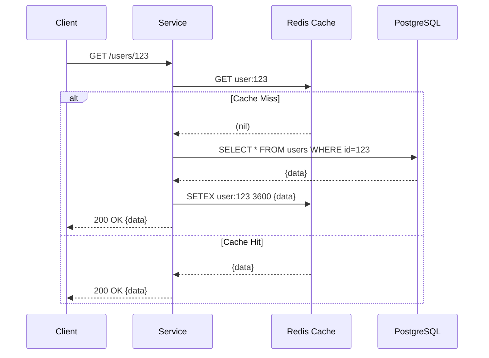

# Redis System-Wide Caching Strategy

> **Version:** 1.1 | **Last Updated:** 2026-03-07 | **Owner:** Platform Engineering

## 1. Overview
The Event Processing Platform relies heavily on **Redis** to provide sub-millisecond data retrieval, maintain idempotency guarantees, enforce API rate limits, and orchestrate distributed locks across identical microservice replicas. This document defines the engineering standards, patterns, and mitigation strategies for Redis utilization to prevent common distributed caching failures.

## 2. Redis Topology

Before implementing any of the patterns below, the correct Redis deployment topology must be selected.

### Topology Decision

| Scenario | Topology | Notes |
|---|---|---|
| Single-region, HA required | **Redis Sentinel** (1 primary + 2 replicas + 3 Sentinel nodes) | Automatic failover; simpler operations; suitable for most deployments |
| Multi-region or extreme scale (>100GB) | **Redis Cluster** (≥6 nodes: 3 primary + 3 replica) | Sharded; hash slots affect key naming (no multi-key ops across slots unless `{}` hash tags are used) |

> **Recommendation**: Start with Redis Sentinel. Migrate to Redis Cluster only when a single shard's memory or throughput is genuinely saturated.

### Mandatory: Separate Redis Instances by Data Criticality

**Critical structural data** (Idempotency keys, JWT blocklists, Rate Limits) must run on a **dedicated Redis instance** configured with:

```
maxmemory-policy noeviction
```

This ensures OOM conditions cause writes to fail (with an error the application can handle) rather than silently evicting keys — which would cause missed rate limits, duplicate charges, or invalidated sessions.

**Volatile cached data** (user profiles, order details) runs on a **separate instance** with:

```
maxmemory-policy volatile-lru
```

| Instance | Data | Eviction Policy |
|---|---|---|
| `redis-critical` | Idempotency keys, JWT blocklist, rate limits | `noeviction` |
| `redis-cache` | User profiles, order details | `volatile-lru` |

## 3. Core Caching Patterns

### Cache-Aside (Lazy Loading)
The primary pattern for read-heavy entities (User Profiles, Order Details). The application code is responsible for managing both the cache and the database.

**Workflow:**
1. Check Redis for `user:profile:{id}`.
2. **If Cache Hit**: Return data immediately.
3. **If Cache Miss**: 
   - Read from PostgreSQL.
   - Serialize to JSON and write to Redis with a TTL.
   - Return data.

**Write Strategy (Invalidation vs. Update):**
We explicitly favor **Cache Invalidation** (`DEL key`) over Cache Updating (`SET key value`) when data changes.
- **Why?** Updating the cache directly during a write transaction introduces race conditions if concurrent writes occur out of order. Deleting the key forces the next read to fetch the consistent state from PostgreSQL.



### Serialization & Versioning Standards

- **Format**: JSON (no binary compression for payloads < 1KB; use `zstd` for payloads > 10KB such as large product catalogs).
- **Schema versioning**: Include the schema version in the key namespace to enable zero-downtime cache migrations:
  - `user:profile:v1:{id}` → `user:profile:v2:{id}` when the profile struct changes.
  - Old keys with TTL will expire naturally; new code writes the new version.
- **Maximum value size**: Keep individual values under **1MB**. Values larger than this indicate a data model problem (e.g., embed fewer nested objects).

## 4. Cache Failure Mitigation Strategies

### 1. Cache Penetration Protection
**Problem**: An attacker continuously requests a non-existent ID (e.g., `GET /orders/99999999`). The cache always misses, and the traffic continuously hits PostgreSQL, potentially bringing it down.
**Mitigation**:
- **Cache Null Values**: If PostgreSQL returns no record, we still write to Redis: `SETEX order:99999999 300 "NOT_FOUND"`. Subsequent requests for that ID hit the cache and receive the `404` boundary without querying the database.
- **Bloom Filters**: (Optional/Advanced) Maintain a Bloom Filter of all valid Order IDs at the API Gateway. Reject requests for missing IDs instantly.

### 2. Cache Breakdown (Dogpile Effect) Protection
**Problem**: A highly requested key (e.g., `product:inventory:iphone15`) abruptly expires. Suddenly, 5,000 concurrent requests all experience a cache miss simultaneously and hammer PostgreSQL with the exact same query.

**Mitigation**:
- **Per-Pod Deduplication (Go `singleflight`)**: Use Go's [`golang.org/x/sync/singleflight`](https://pkg.go.dev/golang.org/x/sync/singleflight) to collapse concurrent cache-miss DB queries within a single pod into one. Only one goroutine executes the query; all others wait and share the result.
  - **Use when**: The dogpile risk is within a single pod (most common case).
- **Cross-Pod Redis Lock**: When multiple pods share the load, combine `singleflight` with a short-lived Redis lock (`SET lock:db:query:{key} 1 NX PX 500`). The first pod to acquire the lock queries the DB; others briefly retry from cache.
  - **Use when**: Your query is extremely expensive and even one-per-pod fanout is unacceptable.

### 3. Cache Avalanche Mitigation
**Problem**: A vast number of cache keys are created at the exact same time with the exact same TTL (e.g., daily batch job runs at midnight and caches 100k items for 24 hours). 24 hours later, they all expire simultaneously, causing a massive database load spike.
**Mitigation**:
- **TTL Jitter**: Never use a static TTL for batch-loaded data. Add a random duration (jitter) to the expiration time.
  - *Bad*: `SETEX key 86400 value` (Exactly 24h)
  - *Good*: `SETEX key (86400 + random(0, 3600)) value` (24h to 25h)

## 5. Rate Limiting Implementation
Implemented primarily at the **API Gateway** to protect internal services.

- **Algorithm**: *Sliding Window Log* or *Token Bucket* executed directly on Redis using **Lua Scripts**.
- **Why Lua?**: Redis Lua scripts execute atomically. This prevents race conditions where two concurrent requests read the same remaining token count and decrement it simultaneously.
- **Key Structure**: `ratelimit:{tier}:{client_ip}` (e.g., `ratelimit:anonymous:192.168.1.50`)
- **TTL**: The key TTL matches the rate limit window (e.g., 60 seconds for a 100 req/min limit) to ensure Redis memory doesn't leak stale IP records.

## 6. Distributed Locks (Redlock)
When multiple K8s pods of the same microservice need exclusive access to a shared resource (e.g., processing a specific payment batch), they use Redis for distributed mutual exclusion.

### Topology Requirement
> **⚠️ Redlock requires a minimum of 3 independent Redis masters.** Running Redlock against a single Redis node or a Sentinel-managed single-primary cluster does NOT provide safety guarantees. A single-node failure causes all in-flight locks to be lost, and a brief network partition can result in two pods simultaneously holding the same lock.

The Redlock algorithm requires acquiring the lock on a **quorum (majority) of N independent masters** (e.g., 3 of 5). If N < 3, use a simpler single-key lock and accept the reduced safety guarantee explicitly in your design.

### Implementation
- **Acquire Lock**: `SET resource_name my_random_value NX PX 30000`
  - `NX`: Only set if it does not exist.
  - `PX 30000`: Auto-release after 30 seconds (prevents deadlocks if the pod crashes holding the lock).
- **Release Lock**: A Lua script that checks if the value matches `my_random_value` before deleting it. This ensures Pod A doesn't accidentally release a lock that expired and was subsequently acquired by Pod B.

## 7. Key Naming Standards & Default TTLs

To prevent key collisions across microservices sharing the same Redis cluster, all keys must use strict namespaces separated by colons.

| Service | Namespace / Pattern | Default TTL | Instance | Eviction Policy |
|---------|---------------------|-------------|----------|-----------------|
| User | `user:profile:v1:{id}` | 1 Hr + Jitter | `redis-cache` | `volatile-lru` |
| Order | `order:detail:v1:{id}` | 10 Mins + Jitter| `redis-cache` | `volatile-lru` |
| API Gateway | `ratelimit:{tier}:{ip}` | Window size | `redis-critical` | `noeviction` |
| API Gateway | `idemp:api:{hash}` | 24 Hrs | `redis-critical` | `noeviction` |
| User | `blacklist:jwt:{jti}` | JWT Expiry | `redis-critical` | `noeviction` |
| Events | `handled:event:{evt_id}` | 7 Days | `redis-critical` | `noeviction` |

> **Key for Redis Cluster users**: Keys in the same hash slot can be grouped using hash tags. For example, `{user:123}:profile` and `{user:123}:settings` will be co-located, enabling multi-key operations. Use this only when you need atomic operations across multiple keys for the same entity.
