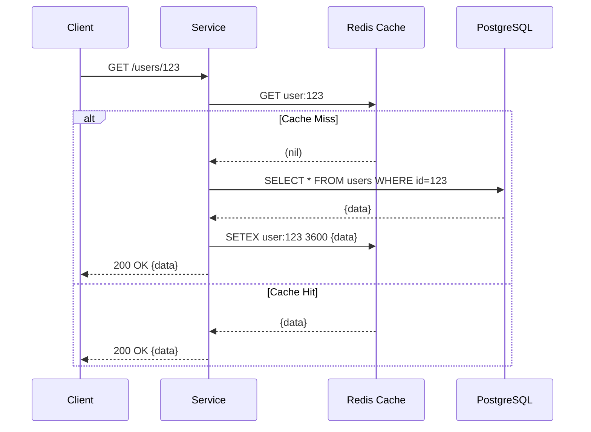

# Redis System-Wide Caching Strategy

## 1. Overview
The Event Processing Platform relies heavily on **Redis** to provide sub-millisecond data retrieval, maintain idempotency guarantees, enforce API rate limits, and orchestrate distributed locks across identical microservice replicas. This document defines the engineering standards, patterns, and mitigation strategies for Redis utilization to prevent common distributed caching failures.

## 2. Core Caching Patterns

### Cache-Aside (Lazy Loading)
The primary pattern for read-heavy entities (User Profiles, Order Details). The application code is responsible for managing both the cache and the database.

**Workflow:**
1. Check Redis for `user:profile:{id}`.
2. **If Cache Hit**: Return data immediately.
3. **If Cache Miss**: 
   - Read from PostgreSQL.
   - Serialize to JSON and write to Redis with a TTL.
   - Return data.

**Write Strategy (Invalidation vs. Update):**
We explicitly favor **Cache Invalidation** (`DEL key`) over Cache Updating (`SET key value`) when data changes.
- **Why?** Updating the cache directly during a write transaction introduces race conditions if concurrent writes occur out of order. Deleting the key forces the next read to fetch the consistent state from PostgreSQL.

## 3. Cache Failure Mitigation Strategies

### 1. Cache Penetration Protection
**Problem**: An attacker continuously requests a non-existent ID (e.g., `GET /orders/99999999`). The cache always misses, and the traffic continuously hits PostgreSQL, potentially bringing it down.
**Mitigation**:
- **Cache Null Values**: If PostgreSQL returns no record, we still write to Redis: `SETEX order:99999999 300 "NOT_FOUND"`. Subsequent requests for that ID hit the cache and receive the `404` boundary without querying the database.
- **Bloom Filters**: (Optional/Advanced) Maintain a Bloom Filter of all valid Order IDs at the API Gateway. Reject requests for missing IDs instantly.

### 2. Cache Breakdown (Dogpile Effect) Protection
**Problem**: A highly requested key (e.g., `product:inventory:iphone15`) abruptly expires. Suddenly, 5,000 concurrent requests all experience a cache miss simultaneously and hammer PostgreSQL with the exact same query.
**Mitigation**:
- **Mutex Lock (Singleflight)**: When a cache miss occurs, the service acquires an in-memory or Redis-based lock. Only the *first* thread queries PostgreSQL and repopulates the cache. The other 4,999 threads wait a few milliseconds and read the newly populated cache.

### 3. Cache Avalanche Mitigation
**Problem**: A vast number of cache keys are created at the exact same time with the exact same TTL (e.g., daily batch job runs at midnight and caches 100k items for 24 hours). 24 hours later, they all expire simultaneously, causing a massive database load spike.
**Mitigation**:
- **TTL Jitter**: Never use a static TTL for batch-loaded data. Add a random duration (jitter) to the expiration time.
  - *Bad*: `SETEX key 86400 value` (Exactly 24h)
  - *Good*: `SETEX key (86400 + random(0, 3600)) value` (24h to 25h)

## 4. Rate Limiting Implementation
Implemented primarily at the **API Gateway** to protect internal services.

- **Algorithm**: *Sliding Window Log* or *Token Bucket* executed directly on Redis using **Lua Scripts**.
- **Why Lua?**: Redis Lua scripts execute atomically. This prevents race conditions where two concurrent requests read the same remaining token count and decrement it simultaneously.
- **Key Structure**: `ratelimit:{tier}:{client_ip}` (e.g., `ratelimit:anonymous:192.168.1.50`)
- **TTL**: The key TTL matches the rate limit window (e.g., 60 seconds for a 100 req/min limit) to ensure Redis memory doesn't leak stale IP records.

## 5. Distributed Locks
When multiple K8s pods of the same microservice need exclusive access to a shared resource (e.g., processing a specific payment batch), they use Redis for distributed mutual exclusion.

- **Implementation**: The **Redlock Algorithm**.
- **Acquire Lock**: `SET resource_name my_random_value NX PX 30000`
  - `NX`: Only set if it does not exist.
  - `PX 30000`: Auto-release after 30 seconds (prevents deadlocks if the pod crashes holding the lock).
- **Release Lock**: A Lua script that checks if the value matches `my_random_value` before deleting it. This ensures Pod A doesn't accidentally release a lock that expired and was subsequently acquired by Pod B.

## 6. Key Naming Standards & Default TTLs

To prevent key collisions across microservices sharing the same Redis cluster, all keys must use strict namespaces separated by colons.

| Service | Namespace / Pattern | Default TTL | Eviction Policy |
|---------|---------------------|-------------|-----------------|
| User | `user:profile:{id}` | 1 Hr + Jitter | `volatile-lru` |
| Order | `order:detail:{id}` | 10 Mins + Jitter| `volatile-lru` |
| API Gateway | `ratelimit:{ip}` | Window size | `volatile-ttl` |
| API Gateway | `idemp:{hash}` | 24 Hrs | `volatile-ttl` |
| User | `blacklist:{jwt_id}` | JWT Expiry | `volatile-ttl` |

*Note: For purely cached data (profiles, orders), if Redis runs out of memory, `volatile-lru` safely evicts the least recently used keys. However, for critical structural data (Idempotency keys, JWT Blacklists, Rate Limits), eviction could cause security/business logic failures. Therefore, these keys rely on absolute `volatile-ttl` and should ideally be isolated to a separate Redis instance if memory pressure is high.*
