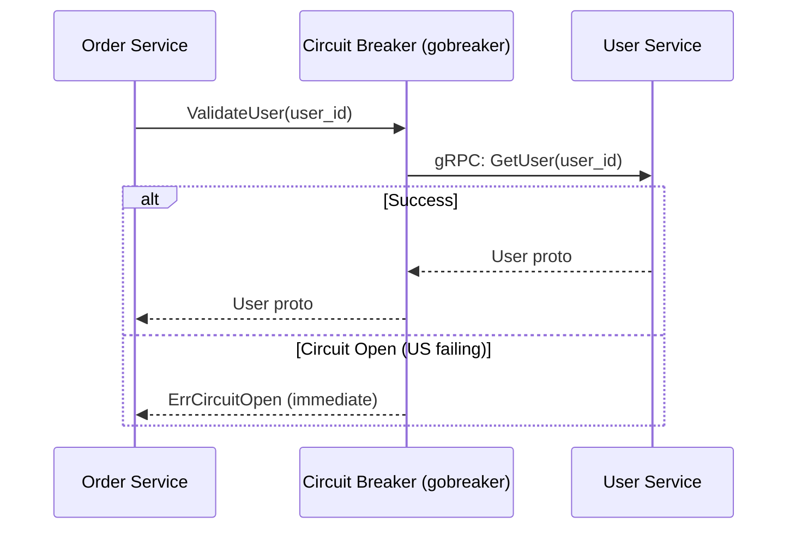
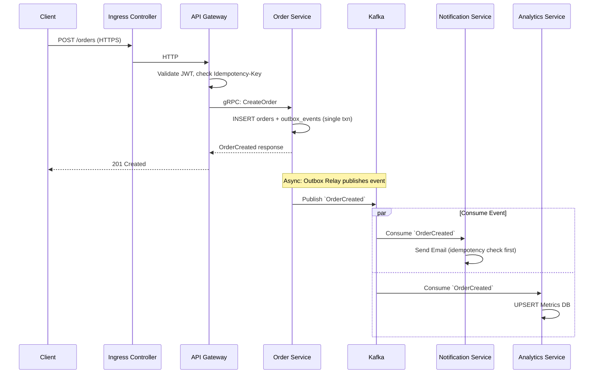

# System Architecture Specification: Event Processing Platform

> **Version:** 1.1 | **Last Updated:** 2026-03-07 | **Owner:** Platform Engineering

## 1. Overview
The **Event Processing Platform** is a highly scalable, distributed backend system designed to manage core business entities (Users, Orders) while asynchronously handling side effects (Notifications, Analytics) through an event-driven architecture. 

### Technology Stack Justification
- **PostgreSQL**: Chosen for its robust ACID compliance, JSONB support, and reliability for structured transactional data (User and Order domains).
- **Redis**: Provides sub-millisecond latency for caching user profiles and maintaining API rate limits and idempotency keys across the API Gateway.
- **Kafka**: Selected over RabbitMQ for its high-throughput, partitioned log architecture, making it ideal for event sourcing, message replay, and decoupling microservices.
- **Docker & Kubernetes (K8s)**: Containerization ensures consistency across environments, while Kubernetes provides self-healing, horizontal scaling, and zero-downtime rolling deployments.
- **CI/CD Pipeline**: Automates testing, container building, and deployment via Helm charts, minimizing human error and reducing time-to-market.

## 2. Responsibilities
- **API Gateway**: Entry point for all external traffic. Handles authentication, routing, rate limiting, and SSL termination.
- **User Service**: Manages user identities, profiles, and authentication credentials.
- **Order Service**: Manages order lifecycle, inventory checks, and payment processing state.
- **Notification Service**: Listens for system events (e.g., `OrderCreated`) and dispatches emails, SMS, or push notifications.
- **Analytics Service**: Consumes business events to aggregate metrics, generate reports, and power dashboards.

## 3. Architecture

### System Overview & Deployment Topology
The system runs within a Kubernetes cluster. External traffic enters through a dedicated **Ingress Controller** (nginx or Traefik), which handles TLS termination and routes traffic to the **API Gateway** — a distinct custom microservice responsible for authentication, rate limiting, and request routing. These are two separate components and must not be conflated.

Stateful infrastructure (PostgreSQL, Redis, Kafka) is hosted on managed cloud services (e.g., AWS RDS, ElastiCache, MSK) outside the application cluster to separate operational concerns.

```mermaid
flowchart TD
    Client[Mobile/Web Clients] -->|HTTPS| Ingress[K8s Ingress Controller\nnginx / Traefik]
    Ingress -->|HTTP| GW[API Gateway Service\nAuth · Rate Limit · Route]
    
    subgraph K8s Cluster — Application Services
        GW --> UserService[User Service]
        GW --> OrderService[Order Service]
        
        UserService <-->|gRPC| OrderService
        
        UserService -->|Publishes via Outbox| Kafka[(Kafka Event Bus)]
        OrderService -->|Publishes via Outbox| Kafka
        
        Kafka -->|Consumes| NotificationService[Notification Service]
        Kafka -->|Consumes| AnalyticsService[Analytics Service]
    end
    
    subgraph Managed Infrastructure
        UserService --> DB_User[(PostgreSQL: Users)]
        OrderService --> DB_Order[(PostgreSQL: Orders)]
        UserService --> Cache_User[(redis-cache)]
        GW --> Cache_Critical[(redis-critical\nRate Limits · Idempotency)]
        AnalyticsService --> DB_Analytics[(PostgreSQL / OLAP)]
    end
```

### Synchronous Service-to-Service Communication
Inter-service HTTP calls (e.g., Order Service querying User Service to validate a user) use **gRPC** exclusively. REST/HTTP is reserved for external client-facing APIs only.

- **Why gRPC?** Strongly-typed Protobuf contracts, auto-generated client/server stubs, bi-directional streaming support, and built-in deadline propagation — all critical for inter-service reliability.
- **Circuit Breakers**: All gRPC clients must wrap outbound calls with a circuit breaker using Go's [`gobreaker`](https://github.com/sony/gobreaker) library. When a downstream service exceeds the failure threshold, the breaker opens and immediately returns an error, preventing cascade failures.



## 4. Data Models

### User Service (PostgreSQL)
**`users` table**
| Column | Type | Constraints | Description |
|--------|------|-------------|-------------|
| `id` | UUID | PRIMARY KEY, DEFAULT gen_random_uuid() | Surrogate key |
| `email` | VARCHAR(255) | UNIQUE, NOT NULL, indexed | Login identifier |
| `password_hash` | VARCHAR(255) | NOT NULL | Argon2id hash |
| `first_name` | VARCHAR(100) | NOT NULL | User's given name |
| `last_name` | VARCHAR(100) | NOT NULL | User's family name |
| `status` | VARCHAR(50) | NOT NULL, DEFAULT 'ACTIVE' | `ACTIVE`, `SUSPENDED`, `DELETED` |
| `deleted_at` | TIMESTAMPTZ | NULLABLE | Soft delete timestamp; NULL = active |
| `created_at` | TIMESTAMPTZ | NOT NULL, DEFAULT now() | Creation timestamp |
| `updated_at` | TIMESTAMPTZ | NOT NULL, DEFAULT now() | Last mutation (trigger-maintained) |

### Order Service (PostgreSQL)
**`orders` table**
| Column | Type | Constraints | Description |
|--------|------|-------------|-------------|
| `id` | UUID | PRIMARY KEY, DEFAULT gen_random_uuid() | Surrogate key |
| `user_id` | UUID | NOT NULL, indexed | Logical FK to `users.id` (no physical FK across services) |
| `idempotency_key` | UUID | UNIQUE, NOT NULL | Prevents duplicate order creation |
| `total_amount_cents` | BIGINT | NOT NULL | Amount in smallest currency unit (avoids float precision issues) |
| `status` | VARCHAR(50) | NOT NULL, DEFAULT 'PENDING' | `PENDING`, `COMPLETED`, `FAILED`, `REFUNDED` |
| `created_at` | TIMESTAMPTZ | NOT NULL, DEFAULT now() | Creation timestamp |
| `updated_at` | TIMESTAMPTZ | NOT NULL, DEFAULT now() | Last mutation (trigger-maintained) |

**`order_items` table**
| Column | Type | Constraints | Description |
|--------|------|-------------|-------------|
| `id` | UUID | PRIMARY KEY | Surrogate key |
| `order_id` | UUID | NOT NULL, FK → `orders.id` | Parent order |
| `product_id` | VARCHAR(100) | NOT NULL | Product reference |
| `quantity` | INT | NOT NULL, CHECK (quantity > 0) | Item count |
| `unit_price_cents` | BIGINT | NOT NULL | Price at time of purchase |

**`outbox_events` table** *(shared by all services that publish events)*
| Column | Type | Constraints | Description |
|--------|------|-------------|-------------|
| `id` | UUID | PRIMARY KEY, DEFAULT gen_random_uuid() | Event ID; used as Kafka message `id` |
| `aggregate_type` | VARCHAR(100) | NOT NULL | e.g., `order`, `user` |
| `aggregate_id` | UUID | NOT NULL, indexed | The ID of the entity that changed |
| `event_type` | VARCHAR(200) | NOT NULL | e.g., `domain.orders.OrderCreated` |
| `payload` | JSONB | NOT NULL | Full CloudEvents-compliant JSON body |
| `status` | VARCHAR(50) | NOT NULL, DEFAULT 'PENDING' | `PENDING`, `PUBLISHED` |
| `created_at` | TIMESTAMPTZ | NOT NULL, DEFAULT now() | When the event was written |

### Analytics Service (PostgreSQL)
**`daily_sales_metrics` table**
| Column | Type | Description |
|--------|------|-------------|
| `date` | DATE | Primary Key |
| `total_orders` | INT | Aggregate count |
| `total_revenue_cents` | BIGINT | Aggregate sum in cents |

## 5. APIs or Interfaces

### API Gateway Exposure
The API Gateway exposes RESTful endpoints to external clients and proxies them to underlying services via gRPC internally.

**Create Order API**
`POST /api/v1/orders`
- **Headers**: `Authorization: Bearer <JWT>`, `Idempotency-Key: <UUID>`
- **Body**:
```json
{
  "items": [
    {"product_id": "prod_1", "quantity": 2}
  ]
}
```
- **Response**: `201 Created`
```json
{
  "order_id": "ord_abc123",
  "status": "PENDING"
}
```

## 6. Workflows

### Data Flow Explanation: Order Creation
The following sequence details how data flows through the system when a user creates an order.

1. **Client** sends `POST /api/v1/orders` to the **Ingress Controller**, which forwards to the **API Gateway**.
2. **API Gateway** validates the JWT (via local public key verification) and checks the `Idempotency-Key` in **redis-critical**.
3. **API Gateway** routes the request to the **Order Service** via gRPC.
4. **Order Service** persists the new order as `PENDING` in **PostgreSQL**, writing both the `orders` row and an `outbox_events` row in the same transaction.
5. A background **Outbox Relay** (Debezium or polling worker) reads the `outbox_events` table and publishes the `OrderCreated` event to **Kafka**.
6. **API Gateway** returns `201 Created` to the client as soon as the Order Service confirms the DB write (the Kafka publish is asynchronous).
7. **Notification Service** consumes `OrderCreated` and sends an order confirmation email.
8. **Analytics Service** consumes `OrderCreated` and updates the real-time sales dashboard metrics.

### Service Interaction Diagram


## 7. Edge Cases
- **Out-of-Order Events**: The Analytics Service uses event timestamps to properly aggregate late-arriving events rather than processing time.
- **Duplicate Event Delivery**: Kafka "at-least-once" delivery semantics require consumers (Notification, Analytics) to implement idempotency using the event's unique ID.
- **User Deletion**: If a user is deleted, the User Service sets `deleted_at` (soft delete) and emits a `UserDeleted` event. The Order Service masks PII on related orders, and the Analytics Service retains anonymous aggregated data.
- **gRPC Deadline Exceeded**: If the Order Service call times out at the API Gateway level, the gateway returns `504 Gateway Timeout`. The client retries with the same `Idempotency-Key`, which is safe due to the DB constraint.

## 8. Performance Considerations
### Scalability Considerations
- **Stateless Microservices**: All API tier services (User, Order) hold no local state, allowing Kubernetes Horizontal Pod Autoscalers (HPA) to scale replicas based on CPU/Memory utilization.
- **Database Read Replicas**: PostgreSQL read replicas handle heavy GET requests, while primary nodes handle writes.
- **Caching Strategy**: The User Service caches user profiles in `redis-cache`. Cache invalidation occurs via Kafka events when a profile is updated.

## 9. Security Considerations
- **Authentication**: Stateless JWT validation at the API Gateway using locally cached public keys (no round-trip to User Service per request).
- **Network Segmentation**: Internal microservices (Order, User, Notification) are not exposed to the public internet; all external ingress flows through the Ingress Controller → API Gateway chain.
- **Secret Management**: All credentials (DB passwords, API keys, JWT signing keys) are stored in an external vault (e.g., HashiCorp Vault, AWS Secrets Manager). We utilize the **External Secrets Operator (ESO)** to authenticate with the vault and seamlessly sync those credentials into native Kubernetes `Secret` objects. This allows standard container environment variable injection while preventing secrets from ever being committed to Git or hardcoded in configurations.

## 10. Observability
### Observability Strategy
- **Centralized Logging**: All services output JSON-formatted logs (with `trace_id` and `span_id`) to stdout. FluentBit scrapes these logs and forwards them to an OpenSearch cluster.
- **Distributed Tracing**: OpenTelemetry instrumentation passes `traceparent` headers through HTTP calls and Kafka message headers, visualized in Jaeger.
- **Metrics & Alarms**: Prometheus scrapes `/metrics` endpoints. Grafana dashboards visualize service health. AlertManager triggers PagerDuty for critical anomalies using SLO burn-rate alerts.
- **Continuous Profiling**: Pyroscope collects always-on Go profiling data (CPU, heap, goroutines) correlated with Grafana dashboards.

## 11. Failure Handling
### Fault Tolerance Design
- **Circuit Breakers**: All gRPC clients use the [`gobreaker`](https://github.com/sony/gobreaker) library (Go-native). When a downstream service exceeds the failure threshold, the breaker opens and returns immediately, preventing cascade failures across services.
- **Retries and Dead Letter Queues (DLQ)**: If the Notification Service cannot reach the external email provider (e.g., SendGrid), the consumer pauses polling and retries with exponential backoff. Failed messages that cannot be recovered are routed to `domain.notifications.dlq`.
- **Transactional Outbox**: To prevent dual-write inconsistencies, the Order Service writes state changes and outgoing events to the same PostgreSQL transaction. A background relay continuously publishes outbox records to Kafka.
