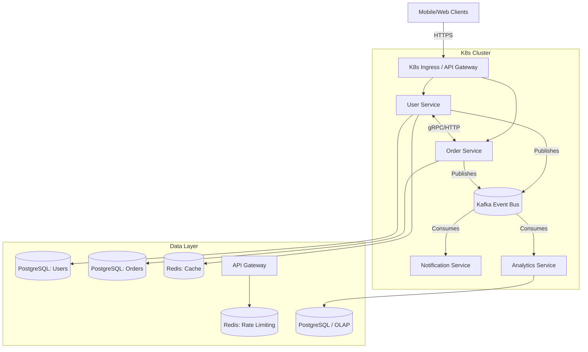
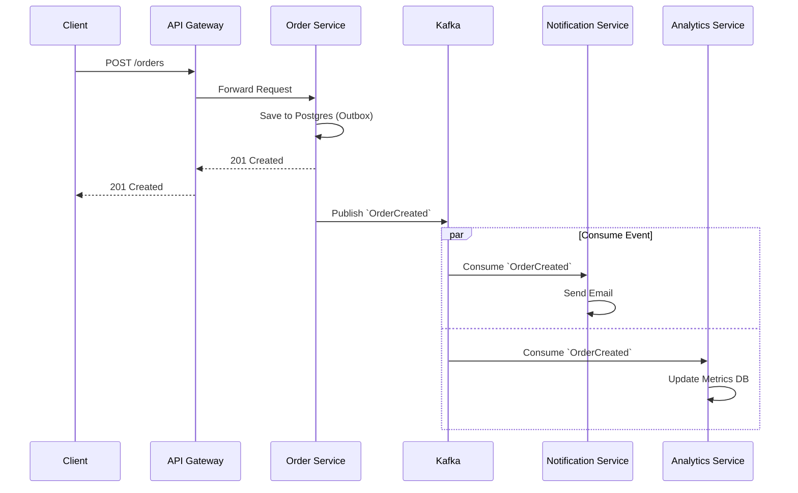

# System Architecture Specification: Event Processing Platform

## 1. Overview
The **Event Processing Platform** is a highly scalable, distributed backend system designed to manage core business entities (Users, Orders) while asynchronously handling side effects (Notifications, Analytics) through an event-driven architecture. 

### Technology Stack Justification
- **PostgreSQL**: Chosen for its robust ACID compliance, JSONB support, and reliability for structured transactional data (User and Order domains).
- **Redis**: Provides sub-millisecond latency for caching user profiles and maintaining API rate limits and idempotency keys across the API Gateway.
- **Kafka**: Selected over RabbitMQ for its high-throughput, partitioned log architecture, making it ideal for event sourcing, message replay, and decoupling microservices.
- **Docker & Kubernetes (K8s)**: Containerization ensures consistency across environments, while Kubernetes provides self-healing, horizontal scaling, and zero-downtime rolling deployments.
- **CI/CD Pipeline**: Automates testing, container building, and deployment via Helm charts, minimizing human error and reducing time-to-market.

## 2. Responsibilities
- **API Gateway**: Entry point for all external traffic. Handles authentication, routing, rate limiting, and SSL termination.
- **User Service**: Manages user identities, profiles, and authentication credentials.
- **Order Service**: Manages order lifecycle, inventory checks, and payment processing state.
- **Notification Service**: Listens for system events (e.g., `OrderCreated`) and dispatches emails, SMS, or push notifications.
- **Analytics Service**: Consumes business events to aggregate metrics, generate reports, and power dashboards.

## 3. Architecture

### System Overview & Deployment Topology
The system runs within a Kubernetes cluster containing multiple namespaces. External traffic enters through an Ingress Controller, routing to the API Gateway. Stateful infrastructure (PostgreSQL, Redis, Kafka) can be hosted on managed cloud services (e.g., AWS RDS, ElastiCache, MSK) or within the cluster using persistent volume claims.



## 4. Data Models

### User Service (PostgreSQL)
**`users` table**
| Column | Type | Description |
|--------|------|-------------|
| `id` | UUID | Primary Key |
| `email` | VARCHAR(255) | Unique, indexed |
| `password_hash` | VARCHAR(255) | Bcrypt hash |
| `created_at` | TIMESTAMPTZ | Creation timestamp |

### Order Service (PostgreSQL)
**`orders` table**
| Column | Type | Description |
|--------|------|-------------|
| `id` | UUID | Primary Key |
| `user_id` | UUID | Foreign Key (Logical) |
| `total_amount` | DECIMAL | Order total |
| `status` | VARCHAR(50) | `PENDING`, `COMPLETED`, `FAILED` |

### Analytics Service (PostgreSQL)
**`daily_sales_metrics` table**
| Column | Type | Description |
|--------|------|-------------|
| `date` | DATE | Primary Key |
| `total_orders` | INT | Aggregate count |
| `total_revenue` | DECIMAL | Aggregate sum |

## 5. APIs or Interfaces

### API Gateway Exposure
The API Gateway exposes RESTful endpoints to clients and routes them to underlying services.

**Create Order API**
`POST /api/v1/orders`
- **Headers**: `Authorization: Bearer <JWT>`, `Idempotency-Key: <UUID>`
- **Body**:
```json
{
  "items": [
    {"product_id": "prod_1", "quantity": 2}
  ]
}
```
- **Response**: `201 Created`
```json
{
  "order_id": "ord_abc123",
  "status": "PENDING"
}
```

## 6. Workflows

### Data Flow Explanation: Order Creation
The following sequence details how data flows through the system when a user creates an order.

1. **Client** sends `POST /api/v1/orders` to the **API Gateway**.
2. **API Gateway** validates the JWT via the **User Service** (or locally via public keys) and routes the request to the **Order Service**.
3. **Order Service** checks the `Idempotency-Key` in **Redis**.
4. **Order Service** persists the new order as `PENDING` in **PostgreSQL**.
5. **Order Service** uses the *Transactional Outbox* pattern to publish an `OrderCreated` event to **Kafka**.
6. **Notification Service** consumes `OrderCreated` and sends an order confirmation email to the user.
7. **Analytics Service** consumes `OrderCreated` and updates the real-time sales dashboard metrics.

### Service Interaction Diagram


## 7. Edge Cases
- **Out-of-Order Events**: The Analytics Service uses event timestamps to properly aggregate late-arriving events rather than processing time.
- **Duplicate Event Delivery**: Kafka "at-least-once" delivery semantics require consumers (Notification, Analytics) to implement idempotency using the event's unique ID.
- **User Deletion**: If a user is deleted, the User Service emits a `UserDeleted` event. The Order Service masks PII on related orders, and the Analytics Service retains anonymous aggregated data.

## 8. Performance Considerations
### Scalability Considerations
- **Stateless Microservices**: All API tier services (User, Order) hold no local state, allowing Kubernetes Horizontal Pod Autoscalers (HPA) to scale replicas based on CPU/Memory utilization.
- **Database Read Replicas**: PostgreSQL read replicas handle heavy GET requests, while primary nodes handle writes.
- **Caching Strategy**: The User Service caches user profiles in Redis. Cache invalidation occurs via Kafka events when a profile is updated.

## 9. Security Considerations
- **Authentication**: Stateless JWT validation at the API Gateway.
- **Network Segmentation**: Internal microservices (Order, User, Notification) are not exposed to the public internet; external ingress only flows through the API Gateway.
- **Secret Management**: Externalized configuration and credentials injected via Kubernetes Secrets or integrating with HashiCorp Vault.

## 10. Observability
### Observability Strategy
- **Centralized Logging**: All services output JSON-formatted logs to standard output. Fluentd/Fluentbit scrapes these logs and forwards them to an Elasticsearch/OpenSearch cluster.
- **Distributed Tracing**: OpenTelemetry instrumentation passes `trace_id` headers through HTTP calls and Kafka message headers, visualized in Jaeger.
- **Metrics & Alarms**: Prometheus scrapes `/metrics` endpoints across all pods. Grafana dashboards visualize service health, and Alertmanager triggers PagerDuty for critical anomalies (e.g., Kafka consumer lag > 10,000 messages).

## 11. Failure Handling
### Fault Tolerance Design
- **Circuit Breakers**: The API Gateway and inter-service HTTP clients use Resilience4j (or a service mesh like Istio) to short-circuit requests to failing downstream services.
- **Retries and Dead Letter Queues (DLQ)**: If the Notification Service cannot reach the external email provider (e.g., SendGrid), the message is retried with exponential backoff. Failed messages are routed to a Kafka DLQ.
- **Transactional Outbox**: To prevent dual-write inconsistencies, the Order Service writes state changes and outgoing events to the same PostgreSQL transaction. A background relay continuously publishes outbox records to Kafka.
