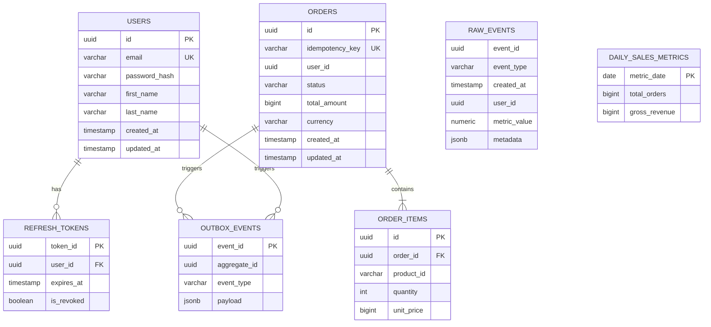

# Database Architecture Specification

## 1. Overview
The Event Processing Platform relies on **PostgreSQL** as its primary persistent data store. This architecture relies on logically isolated databases or schemas per microservice to enforce service autonomy, while providing high availability and performance through structured indexing, connection pooling, and strict schema versioning.

## 2. Multi-Service Database Ownership Rules
To maintain the integrity of the microservices architecture, the following rules are strictly enforced:
1. **The Database per Service Pattern**: Each microservice (`UserService`, `OrderService`, `AnalyticsService`) owns its own logical database (e.g., `users_db`, `orders_db`). Alternatively, they share a physical cluster but own distinct Schemas (`schema_users`, `schema_orders`).
2. **No Cross-Database Queries**: Microservice A cannot query Microservice B's database directly. All cross-domain data access must go through:
   - Synchronous gRPC / HTTP APIs (for real-time reads).
   - Asynchronous Event consumption via Kafka (for replication/caching).
3. **Database Credentials**: Services use unique database credentials restricted *only* to their specific logical database or schema.
4. **Independent Migrations**: Database schemas evolve independently via their owning microservice's CI/CD pipeline.

## 3. Entity-Relationship (ER) Diagrams

*Note: The relationship lines spanning across microservices (e.g., `ORDERS.user_id` referencing `USERS.id`) are **logical constraints** maintained by the application and event architecture, NOT foreign key constraints enforced by the database engine.*

## 4. Schema Design for All Services

### 4.1 User Service (`users_db`)
Handles identities and credentials.
- **`users`**: Stores core profile. `email` has a `UNIQUE INDEX` and is enforced at the database level to prevent duplicate registrations.
- **`refresh_tokens`**: Maintains active sessions.
- **`outbox_events`**: Holds `UserCreated` and `UserDeleted` payloads for the Transactional Outbox.

### 4.2 Order Service (`orders_db`)
Handles the transactional financial orders.
- **`orders`**: Core order metadata. Contains critical `idempotency_key` with a `UNIQUE INDEX` to guard against duplicate payment captures. `total_amount` is stored in minor units (e.g., cents) as a `bigint` to avoid floating-point errors, alongside a `currency` code.
- **`order_items`**: Line items constrained to `order_id` via a strict `FOREIGN KEY (order_id) REFERENCES orders(id) ON DELETE RESTRICT`. `unit_price` also uses minor units.
- **`outbox_events`**: Standard Outbox table.

### 4.3 Analytics Service (`analytics_db`)
Handles massive ingestion volumes.
- **`raw_events`**: Append-only log. Uses **PostgreSQL Declarative Partitioning** (`PARTITION BY RANGE (created_at)`). No `UNIQUE` constraints to maintain write throughput. Note that the partition key (`created_at`) must be included in the Primary Key or Unique constraints if you choose to add them later.
- **`daily_sales_metrics`**: Rollup tables updated via UPSERT (`INSERT ... ON CONFLICT (metric_date) DO UPDATE`).

## 5. Indexing Strategies & Query Optimization

### 1. Primary and Foreign Keys
- All PKs MUST use **UUIDv7**. `UUIDv7` embeds a timestamp, making it sequentially sortable while remaining decentralized and globally unique, drastically improving database page caching and insert speed compared to completely random `UUIDv4` which leads to index fragmentation.
- All local Foreign Keys (e.g., `order_items.order_id`) MUST have B-Tree indexes to optimize `JOIN` operations and prevent full table scans during `ON DELETE` cascade checks.

### 2. Time-Series Optimization (BRIN)
- For chronologically appended tables (`analytics_db.raw_events`, `outbox_events`), use **BRIN (Block Range Indexes)** on `created_at` instead of B-Trees. BRIN indexes occupy a fraction of the RAM and provide tremendous speedups for time-bounded queries.

### 3. JSONB Indexing (GIN)
- For the `payload` or `metadata` columns in `outbox_events` and `raw_events`, use **GIN (Generalized Inverted Index)**.
- **Optimization**: Do not index the entire JSON document (`jsonb_path_ops`). Create targeted expression indexes for specific deeply nested keys that are frequently queried (e.g., `CREATE INDEX ON raw_events USING GIN ((metadata->>'stripe_charge_id'))`).

### 4. Partial Indexes
- For tables spanning active and historical data, use partial indexes to save RAM.
- Example: If an application needs to query only active users:
  `CREATE INDEX idx_active_users ON users(email) WHERE is_active = true;`

## 6. Connection Pooling

In a horizontally scaled microservices architecture, database connections can easily become exhausted.
- **Infrastructure-level Pooler**: Use a pooler like **PgBouncer** or **Pgpool-II** configured in `transaction` mode to multiplex thousands of client connections onto a small number of actual PostgreSQL connections.
- **Application-level Pooler**: Maintain a small, healthy pool within the application (e.g., `pgxpool` in Go or `HikariCP` in Java) to minimize connection overhead.

## 7. Security & PII Compliance (GDPR/CCPA)

Handling sensitive user data requires strict compliance measures:
- **Data at Rest Encryption**: Rely on transparent disk encryption (e.g., AWS EBS encryption) for the database volumes.
- **Column-level Encryption**: For highly sensitive PII in the `users_db` (e.g., SSN, financial/health data), use application-level encryption before storing the data. Standard PII like `first_name` and `last_name` should be protected by strict RBAC and network isolation.
- **Auditing**: Use `updated_at` timestamps on mutable tables (`USERS`, `ORDERS`), ideally enforced by a PostgreSQL trigger to prevent application-level bugs.

## 8. Migration Strategy

Schema migrations must be strictly forward-compatible to enable zero-downtime deployments.

1. **Tooling**: Use standard programmatic migration tools (e.g., `golang-migrate`, Flyway, or Liquibase).
2. **Process**:
   - Migrations are executed as **Kubernetes Init Containers** or dedicated pre-sync Helm jobs before the new application pods start.
3. **The "Expand and Contract" Pattern**:
   - **Phase 1 (Expand)**: Add the new column (nullable) or table. Deploy code that writes to *both* old and new columns, but reads from the old.
   - **Phase 2 (Migrate)**: Run a background script to backfill data from the old column to the new column.
   - **Phase 3 (Cutover)**: Deploy code that reads and writes *only* to the new column.
   - **Phase 4 (Contract)**: Drop the old column in a subsequent release.

## 9. Data Consistency Model

### Transactional Consistency (Local)
Within the boundaries of a single microservice, we rely on PostgreSQL's strict ACID properties at the `READ COMMITTED` isolation level.
- Creating an Order and its Order Items is wrapped in a `BEGIN; ... COMMIT;` transaction block.

### Eventual Consistency (Distributed)
Across the platform, we embrace **Eventual Consistency** utilizing the Saga and Outbox patterns.
- **The Dual-Write Problem**: A service must never write to PostgreSQL and call a Kafka Producer sequentially within API logic, as one could fail while the other succeeds.
- **Transactional Outbox**: By writing the domain state (`orders`) and the event payload (`outbox_events`) in the *same* local Postgres transaction, we guarantee the event is persisted. A background worker (Debezium) reading the WAL (Write-Ahead Log) ensures the event eventually reaches Kafka via Change Data Capture (CDC), completely avoiding polling overhead.
- **Saga Compensations**: Since distributed transactions cannot simply "rollback," failures (e.g., payment declined) require compensating transactions. For example, if the Order Service emits `OrderCreated`, and the Payment Service fails to process it, it emits `PaymentFailed`. The Order Service consumes this to asynchronously update the `orders` table `status` to `CANCELLED`. Correlation IDs in the event payloads tie these spanning operations together.
- **Idempotency checks**: Because eventually consistent networks can retry deliveries, `UNIQUE INDEX` constraints inside PostgreSQL (e.g., `orders.idempotency_key`) act as the absolute final defense against duplicate operations.
