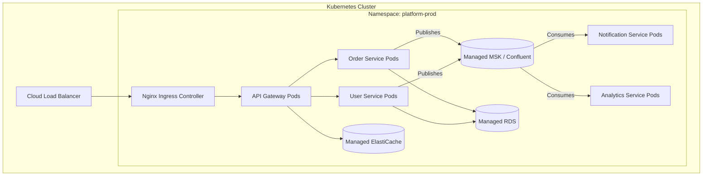

# DevOps & Deployment Architecture Specification

## 1. Overview
The Event Processing Platform embraces Cloud-Native principles, treating infrastructure as immutable and relying heavily on container orchestration. This specification details the journey of code from a developer's machine to the production Kubernetes cluster, emphasizing consistency, security, and observability.

## 2. Infrastructure as Code (IaC)

Base infrastructure provisioning is handled declaratively using **Terraform** (or OpenTofu).
- **Scope**: VPCs, Subnets, IAM Roles, Kubernetes Clusters (e.g., EKS/GKE), and Managed Services (RDS, MSK/Kafka, ElastiCache).
- **State Management**: Remote state backends (e.g., AWS S3 + DynamoDB for locking) ensure consistent, collaborative infrastructure updates.

## 3. Docker Container Strategy

### Service Image Design
All microservices (API Gateway, User, Order, Notification, Analytics) must be packaged into lightweight, secure Docker images adhering to the following standards:

1. **Multi-Stage Builds**:
   - *Builder Stage*: Contains the full compiler suite (e.g., `golang:1.21` or `node:20`), downloads dependencies, runs unit tests, and compiles the binary.
   - *Production Stage*: Uses a bare-minimum root filesystem (e.g., `alpine`, `distroless`, or `scratch`) containing *only* the compiled binary and essential CA certificates.
2. **Security Contexts**: 
   - **Non-Root Execution**: Containers must define a `USER nonroot` explicitly in the Dockerfile and never run as root.
   - **Read-Only Filesystem**: Enforce `readOnlyRootFilesystem: true` in K8s security contexts to prevent attackers from downloading or writing malicious scripts.
3. **Immutability**: Image tags use the exact Git SHA (e.g., `my-service:a1b2c3d`) rather than mutable tags like `latest`.
4. **Health Probes**: Every image exposes HTTP endpoints for Kubernetes:
   - `/health/liveness`: Indicates if the pod is deadlocked and needs restarting.
   - `/health/readiness`: Indicates if the pod has connected to its dependencies and is ready to receive traffic.

## 4. Local Development Environment

Developers orchestrate the entire platform locally using **Docker Compose** to guarantee environment parity (Dev/Prod equivalence).

### Docker Compose Architecture
- **Infrastructure Containers**: `postgres:15-alpine`, `redis:7-alpine`, `confluentinc/cp-kafka`.
- **Service Containers**: Built locally via `docker compose build`. Code directories are mounted via volumes for hot-reloading during active development.
- **Networking**: All services run on a custom bridge network (`platform_network`). Only the API Gateway exposes port `8080` to the host machine. Service-to-service communication uses Docker's internal DNS.

## 5. Kubernetes Deployment Architecture

Production traffic is served from a managed Kubernetes cluster.

### K8s Manifest Standards (Helm)
Services are deployed via **Helm Charts** defining:
- **Deployments**: Describing replica counts, container images, and resource limits (e.g., Memory limits: `512Mi` to prevent OOM cascading failures).
- **Autoscaling**:
  - Horizontal Pod Autoscalers (HPA) for HTTP-driven services based on CPU/Memory.
  - **KEDA (Kubernetes Event-driven Autoscaling)** for event-driven workers (Notification, Analytics) based on Kafka consumer group lag.
- **Pod Disruption Budgets (PDB)**: Ensuring at least 50% of a service's replicas remain available during cluster nodes upgrades.
- **Network Policies**: Default deny rules. For example, explicitly defining that only the Order and User pods can communicate with RDS, preventing the API Gateway from direct database access.

## 6. CI/CD Pipeline

The pipeline is managed via **GitHub Actions** (or Gitlab CI). It enforces strict progression from code commit to production deployment.

### Continuous Integration (CI) - Triggered on Pull Request
1. **Linting & Formatting**: Enforce code style.
2. **Static Application Security Testing (SAST)**: Run application-specific tools like `Semgrep`, `gosec` (Go), or `njsscan` (Node) to catch SQL injections and hardcoded secrets. (Use `tfsec`/`trivy` specifically for IaC scanning).
3. **Unit & Integration Testing**: Spin up Ephemeral PostgreSQL/Redis via Testcontainers. Run suites.
4. **Build Image**: Compile Docker image.
5. **Security Scanning & SBOM**: Scan final image layers with `Trivy` for CVEs (fail on `CRITICAL`). Generate a Software Bill of Materials (SBOM) using `Syft` for compliance.

### Continuous Deployment (CD) - Triggered on Merge to Main
1. **Push Image**: Tag image with the Git SHA and push to the Container Registry (e.g., ECR, GAR).
2. **Update Helm Values**: Automatically update the `image.tag` value in the separate GitOps configuration repository.
3. **ArgoCD (GitOps)**: ArgoCD detects the config change and initiates a rolling update in K8s without exposing cluster credentials to the CI pipeline.

## 7. Secrets Management & Disaster Recovery

- **Secrets**: NEVER stored in Git. We utilize the **External Secrets Operator (ESO)**.
  - Secrets are stored in a secure vault (AWS Secrets Manager, Vault).
  - ESO authenticates via IAM Roles (IRSA) and syncs vault secrets into native K8s `Secret` objects.
  - Pods mount these natively as Environment Variables or RAM-backed volumes.
- **Data Backup & DR**:
  - Managed databases (RDS) utilize automated daily snapshots and point-in-time recovery to meet defined RPO/RTO targets.

## 8. Infrastructure Monitoring & Observability

Observability is treated as a first-class citizen using the OpenTelemetry specification.

- **Metrics Collection**: Microservices expose a `/metrics` Prometheus endpoint. A cluster-internal Prometheus server scrapes these, and Grafana visualizes dashboards (Go/Node heaps, HTTP errors, Kafka lag).
- **Log Aggregation**: Containers write JSON logs to standard output. **Fluent Bit** DaemonSets collect logs and ship them to ElasticSearch or OpenSearch.
- **Distributed Tracing**: The API Gateway initiates an OpenTelemetry trace ID. This ID is passed via HTTP Headers (`traceparent`) and Kafka record headers. Traces export to Jaeger/Tempo to visualize multi-service latencies. *(Note: Consider a Service Mesh like Istio/Linkerd for seamless mTLS and network-level observability).*
