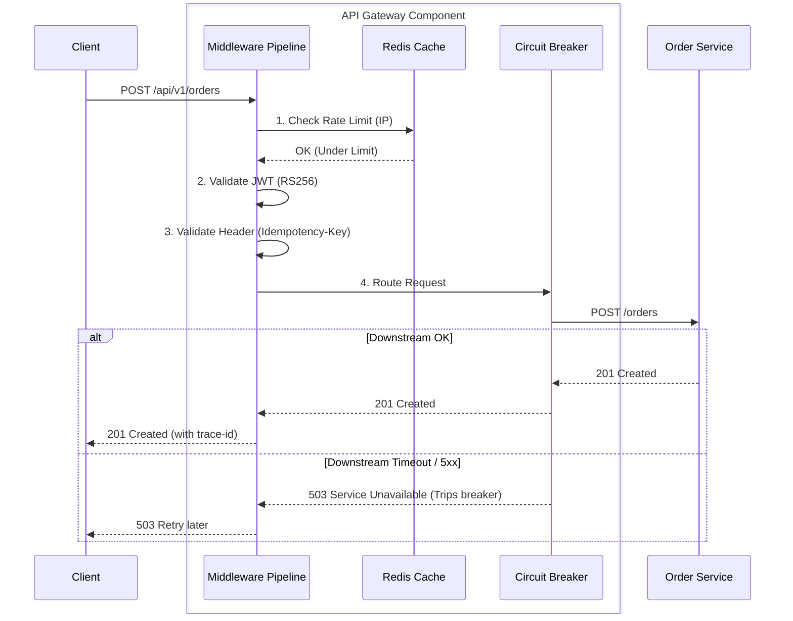

# API Gateway Engineering Specification

## 1. Overview
The **API Gateway** serves as the unified entry point for all external traffic entering the Event Processing Platform. It abstracts the internal microservices topology from external clients, handling cross-cutting concerns such as request routing, authentication, rate limiting, and observability.

### Technology Stack Justification
Let's use **Go and Gin** due to its superior raw concurrent throughput, low memory footprint, and native goroutine support, which is critical for a high-IO bound routing component handling thousands of requests per second.

## 2. Responsibilities
- **Request Routing**: Reverse proxy requests to appropriate downstream services (`User Service`, `Order Service`).
- **Authentication**: Validate JWT tokens at the edge before traffic reaches internal services.
- **Rate Limiting**: Throttling traffic per IP or per API Key to prevent abuse and DDoS attacks.
- **Request Validation**: Basic schema/header validation (e.g., verifying `Idempotency-Key` presence).
- **Response Caching**: Cache idempotent GET requests (e.g., public catalogs) at the edge.
- **Circuit Breaking**: Fail fast if downstream services are unresponsive.
- **Observability**: Distributed trace propagation and centralized access logging.

## 3. Architecture

### Middleware Pipeline
Requests traverse a configured middleware chain before being proxied downstream:
1. **Recovery Middleware**: Catches panics.
2. **Observability Middleware**: Initializes tracing (OpenTelemetry) and logs the incoming request.
3. **CORS Middleware**: Handles preflight requests.
4. **Rate Limiter Middleware**: Checks Redis counter for the client IP / API Key.
5. **Auth Middleware**: Validates JWT signature and expiry.
6. **Validation Middleware**: Checks for required headers (`X-Request-ID`, `Idempotency-Key`).
7. **Cache Middleware**: Returns cached response for GET routes if available.
8. **Reverse Proxy (Director)**: Routes the request to K8s internal service DNS, wrapped in a Circuit Breaker.

## 4. Workflows

### Request Flow Diagram


## 5. Security & Authentication

### Authentication Strategy (JWT)
- **Token Format**: Standard JSON Web Tokens (JWT) signed via **RS256** (RSA Signature).
- **Validation**: The Gateway periodically fetches public keys (JWKS) from the auth authority. It validates the signature locally without making a network hop per request.
- **Claims Verification**: Extracts the `sub` (User ID) and injects it into a trusted internal header `X-User-Id` before proxying downstream. Downstream services implicitly trust this header.

## 6. Performance & Scale

### Horizontal Scaling Strategy
- The Gateway is 100% stateless.
- **K8s HPA**: Scales horizontally based on average CPU utilization targeting 60%.
- **Keep-Alive**: Configured to reuse TCP connections to upstream clients and internal microservices.

### Redis Rate Limiting Strategy
- **Algorithm**: *Sliding Window Log* or *Token Bucket* implemented via Redis Lua Scripts to guarantee atomicity.
- **Limits**: Configured at multiple tiers (e.g., 100 req/sec per IP, 1000 req/min per User).
- **Headers**: Returns `X-RateLimit-Limit`, `X-RateLimit-Remaining`, and `X-RateLimit-Reset` to the client.

### Response Caching
- Cacheable endpoints (`GET /products`) use a Redis pattern (`cache:GET:products:<query_hash>`).
- Cached responses include `ETag` and `Cache-Control` headers for downstream browser caching.

## 7. Failure Handling

### Circuit Breaking
- Wrap internal downstream calls with a library like Go's `gobreaker`.
- **Threshold**: e.g., Open the circuit if 5 consecutive 5xx errors occur within 10 seconds.
- **Fallback**: Returns a generic `503 Service Unavailable` with `Retry-After` header immediately without waiting for timeouts, protecting the downstream service from thundering herds during recovery.

### Error Handling Protocol
All Gateway exceptions return a standardized JSON problem payload:
```json
{
  "error": "rate_limit_exceeded",
  "message": "Too many requests from this IP",
  "status_code": 429,
  "trace_id": "req-xyz-123"
}
```

## 8. Observability

### Metrics and Tracing
- **Tracing**: Injects `X-Trace-Id` generated via OpenTelemetry into the context, passing it as an HTTP header to downstream services.
- **Metrics**: Exposes `/metrics` endpoint with Prometheus counters:
  - `http_requests_total{method="GET", route="/users", status="200"}`
  - `http_request_duration_seconds{route="/orders"}`
  - `rate_limit_hits_total{tier="anonymous"}`
- **Logging**: Emits structured JSON access logs containing: `client_ip`, `method`, `path`, `status`, `latency_ms`, `user_agent`, and `trace_id`.

## 9. Example API Contracts

### **Route: Create Order**
- **External View**:
  - `POST /api/v1/orders`
  - Headers: `Authorization: Bearer <token>`, `Idempotency-Key: <uuid>`
- **Internal Proxied View (to Order Service)**:
  - `POST http://order-service:8080/v1/orders`
  - Appended Headers: `X-User-Id: <uuid from token>`, `X-Trace-Id: <trace-id>`

### **Route: Get User Profile**
- **External View**:
  - `GET /api/v1/users/me`
  - Headers: `Authorization: Bearer <token>`
- **Internal Proxied View (to User Service)**:
  - `GET http://user-service:8080/v1/users/<extracted-user-id>`
  - Appended Headers: `X-User-Id: <uuid>`, `X-Trace-Id: <trace-id>`
