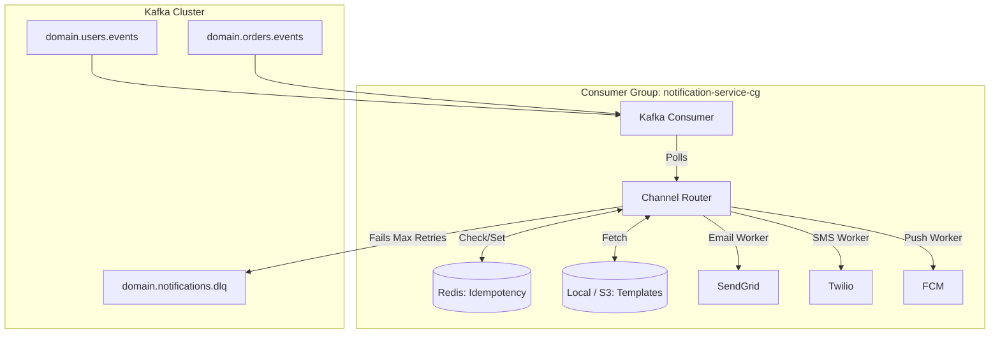

# Notification Service Engineering Specification

## 1. Overview
The **Notification Service** is an asynchronous, highly decoupled microservice entirely driven by events from the message broker (Kafka). Its core responsibility is to translate domain events (e.g., `OrderCreated`, `UserRegistered`) into human-readable notifications dispatched across various channels: Email, SMS, and Push Notifications.

## 2. Responsibilities
- **Event Consumption**: Continuously poll Kafka topics for relevant business events.
- **Provider Aggregation**: Manage integrations with third-party providers:
  - **Email**: SendGrid or AWS SES
  - **SMS**: Twilio or AWS SNS
  - **Push**: Firebase Cloud Messaging (FCM) or Apple Push Notification Service (APNs)
- **Template Rendering**: Merge event payload data into localized HTML or text templates.
- **Rate Limiting (Vendor Quotas)**: Throttle outgoing API requests to comply with third-party rate limits.
- **Idempotency**: Prevent duplicate notifications if Kafka delivers a message more than once (At-Least-Once delivery semantics).
- **Retry & DLQ Management**: Intelligently retry strictly transient failures and offload poison pills to a Dead Letter Queue (DLQ).

## 3. Architecture

### Event Consumer Topology
The service does not expose a public HTTP API for triggering notifications; it is entirely reactive. 



## 4. Workflows

### Queue Consumption Strategy
1. **Poll**: The consumer reads a batch of messages from `domain.orders.events` (e.g., `batch.size=100`).
2. **Idempotency Check**: For each message, extract the `eventId`. Attempt a Redis `SETNX handled:{eventId} true EX 604800` (7-day TTL).
   - If false (already exists), explicitly acknowledge the offset to Kafka and skip processing.
3. **Route**: Inspect `eventType` (e.g., `OrderCreated`). Look up user preferences from a local High-Speed Cache materialized from a Kafka compacted topic (e.g., `users_preferences_compacted`). This eliminates synchronous gRPC network hops to the User Service.
4. **Render**: Fetch the template `order_created_email_en.html` and inject the `data.totalAmountCents` payload.
5. **Dispatch**: Aggregate notifications and send batch HTTP requests to third-party providers (e.g., SendGrid, FCM) that support bulk dispatching. This reduces outbound connection overhead and helps avoid strict rate limits.
6. **Commit**: Strictly commit the Kafka offset *only* after a successful 2xx response from the provider or routing to the DLQ.

## 5. Data Models & Templates

### Event Formats (Consumption)
The service expects strict CloudEvents schema compliance.
```json
{
  "eventId": "evt_abc123",
  "eventType": "OrderCreated",
  "data": {
    "userId": "usr_9cc9b6",
    "totalAmountCents": 5000,
    "currency": "USD"
  }
}
```

### Notification Templates
Templates use a templating engine (e.g., Go `text/template`, Handlebars, or Jinja2).
- **Template Management**: Templates are stored centrally in an S3 Bucket and cached in-memory by the Notification Service. The service exposes an admin endpoint to flush the cache or polls S3 periodically.

**`order_created_email_en.html`**
```html
<h1>Order Confirmation</h1>
<p>Thank you for your order! Your total is: {{ formatCurrency data.totalAmountCents data.currency }}</p>
<p>Log in to view your shipping status.</p>
```

## 6. Failure Handling & Retry Strategy

### 1. Vendor Rate Limiting
Third-party providers strictly enforce API quotas.
- **Client-Side Throttling**: The Notification Service uses a local Token Bucket or Leaky Bucket algorithm (e.g., Go `x/time/rate`) to throttle its own outbound API calls to SendGrid/Twilio exactly below their documented limits (e.g., 50 req/sec). 
- If Kafka is producing 5,000 events/sec, the service will naturally build up consumer lag rather than flooding and getting blacklisted by SendGrid.

### 2. Retry Logic
When an outbound HTTP request to a provider fails, the service inspects the HTTP Status Code:
- **Transient Failures (429, 500, 502, 503, 504)**: Apply **Exponential Backoff with Jitter**.
  - Attempt 1: Wait 1s
  - Attempt 2: Wait 2s
  - Attempt 3: Wait 4s
  - After 3 failures, the message is routed to the **DLQ**.
- **Permanent Failures (400, 401, 403, 404)**: Do not retry. The payload is malformed or credentials are revoked. Route immediately to the **DLQ**.

### 3. Dead Letter Queues (DLQ)
Messages that exhaust retries or trigger unhandled schema parsing exceptions are pushed to a dedicated Kafka topic: `domain.notifications.dlq`.
- **Structure**: The DLQ message wraps the original payload with metadata:
```json
{
  "original_event": { /* ... */ },
  "failure_reason": "SendGrid HTTP 403 Forbidden",
  "failed_at": "2026-03-07T12:05:00Z",
  "consumer_group": "notification-service-cg"
}
```
- **Resolution**: Engineering teams set up alerts on the DLQ topic. Once the root cause (e.g., expired API key) is fixed, a manual replay script consumes the DLQ and pushes messages back to the primary topics.

## 7. Security & Observability

### Security Considerations
- **PII Leakage**: Notifications inherently contain Personal Identifiable Information (Emails, Phone Numbers). The service must use TLS for all outgoing provider traffic. 
- Loggers must be explicitly configured to **mask** or Drop PII inside the JSON payload before writing to `stdout` to avoid polluting Elasticsearch/Datadog.

### Observability
- **Metrics**: 
  - `kafka_consumer_lag`: Critical alert threshold.
  - `notification_sent_total{provider="twilio", status="success"}`
  - `notification_retries_total`
- **Tracing**: Extract `trace_id` from Kafka record headers. The trace will visually link the initial `POST /orders` API request all the way through the async Kafka publish to the final SendGrid API invocation.
