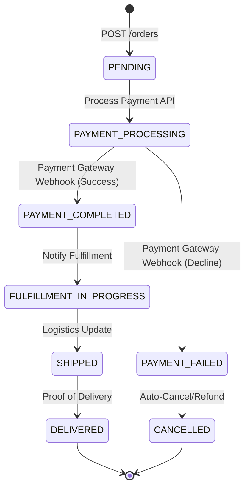

# Order Service Engineering Specification

## 1. Overview
The **Order Service** is the central orchestrator for the core business transaction: the `Order`. It manages the lifecycle of an order from creation to fulfillment, interacting with the Payment Gateway (e.g., Stripe, PayPal) and guaranteeing transactional consistency. It heavily utilizes the Transactional Outbox pattern to broadcast order state changes to the rest of the Event Processing Platform via Kafka.

## 2. Responsibilities
- **Order Creation**: Accept, validate, and persist new customer orders idempotently.
- **Order Status Tracking**: Maintain the state machine of an order (`PENDING`, `PAYMENT_APPROVED`, `SHIPPED`, etc.).
- **Payment Integration**: Securely coordinate with external payment processors.
- **Event Publishing**: Publish rich, schema-validated events to Kafka (e.g., `OrderCreated`, `PaymentFailed`) for downstream consumption.
- **Caching**: Serve high-volume read requests for order status efficiently via Redis.

## 3. Architecture & Order State Machine

### Order State Machine
The core domain logic is governed by a strict state machine implemented using the **Saga Pattern** to coordinate distributed transactions across the Payment and Warehouse/Logistics domains. Valid state transitions are tightly controlled to prevent illegal operations (e.g., attempting to refund an un-paid order).



## 4. Data Models

### PostgreSQL Schema Design
The transactional data store ensuring ACID properties for all financial records.

**Table: `orders`**
| Column | Type | Constraints | Description |
|--------|------|-------------|-------------|
| `id` | UUID | PRIMARY KEY | Unique identifier. |
| `idempotency_key`| VARCHAR(255) | UNIQUE, NOT NULL | Prevents duplicate charges. |
| `user_id`| UUID | NOT NULL | Customer identifier. |
| `status` | VARCHAR(50) | NOT NULL | e.g., `PENDING`. |
| `total_amount_cents` | BIGINT | NOT NULL | Total amount in cents. |
| `currency` | VARCHAR(3) | DEFAULT 'USD' | ISO 4217 Currency Code. |
| `created_at` | TIMESTAMPTZ | DEFAULT NOW() | Timestamp. |
| `updated_at` | TIMESTAMPTZ | DEFAULT NOW() | Timestamp. |

**Table: `order_items`**
| Column | Type | Constraints | Description |
|--------|------|-------------|-------------|
| `id` | UUID | PRIMARY KEY | Unique identifier. |
| `order_id` | UUID | FOREIGN KEY | `REFERENCES orders(id)`. |
| `product_id` | VARCHAR(255) | NOT NULL | SKU or product ID. |
| `quantity` | INTEGER | CHECK (quantity > 0) | Quantity ordered. |
| `unit_price_cents` | BIGINT | NOT NULL | Price per unit in cents. |

**Table: `outbox_events`**
| Column | Type | Constraints | Description |
|--------|------|-------------|-------------|
| `id` | UUID | PRIMARY KEY | Event ID. |
| `aggregate_type` | VARCHAR(100) | NOT NULL | e.g., `order`. |
| `aggregate_id` | UUID | NOT NULL | The order aggregate ID. |
| `event_type` | VARCHAR(200) | NOT NULL | e.g., `domain.orders.OrderCreated`. |
| `payload` | JSONB | NOT NULL | Full event structure. |
| `status` | VARCHAR(20) | DEFAULT 'PENDING' | `PENDING`, `PUBLISHED`. |
| `created_at` | TIMESTAMPTZ | DEFAULT NOW() | Timestamp. |

## 5. Event Schema (Kafka)

All events published to the `domain.orders.events` topic must conform to the following CloudEvents-inspired JSON structure:

**`OrderCreated` Event Payload (CloudEvents v1.0):**
```json
{
  "specversion": "1.0",
  "type": "domain.orders.OrderCreated",
  "source": "/services/order-service",
  "id": "evt_abc123",
  "time": "2026-03-07T12:00:00Z",
  "datacontenttype": "application/json",
  "subject": "ord_987654",
  "data": {
    "user_id": "usr_9cc9b6",
    "totalAmountCents": 5000,
    "currency": "USD",
    "items": [
      {
        "productId": "prod_a1",
        "quantity": 1,
        "unitPriceCents": 5000
      }
    ]
  }
}
```

## 6. API Contracts

### **1. Create Order (Idempotent)**
`POST /v1/orders`

- **Headers:** `Idempotency-Key` (UUID, Required), `X-User-Id` (Injected by Gateway)
- **Request Body:**
```json
{
  "items": [
    {
      "product_id": "prod_a1",
      "quantity": 1
    }
  ],
  "payment_method_id": "pm_card_visa"
}
```
- **Response (201 Created):**
```json
{
  "order_id": "ord_987654",
  "status": "PENDING",
  "total_amount_cents": 5000
}
```

### **2. Get Order Status**
`GET /v1/orders/{order_id}`

- **Headers:** `X-User-Id` (For Authorization: Ensure user owns the order)
- **Response (200 OK):**
```json
{
  "id": "ord_987654",
  "status": "PAYMENT_COMPLETED",
  "created_at": "2026-03-07T12:00:00Z"
}
```

## 7. Caching Strategy
To serve the high volume of "Where is my order?" requests, the service utilizes Redis.

- **Key**: `order:detail:v1:{order_id}`
- **TTL**: 10 minutes + jitter.
- **Asynchronous Cache Invalidation (CDC)**: Instead of a synchronous `DEL` command that can lead to data races between parallel requests, the service employs **Change Data Capture (Debezium)** to listen to PostgreSQL WAL changes and automatically invalidate/update Redis. This ensures the cache perfectly mirrors the database state.
- **Read-Through**: Upon `GET /v1/orders/{id}`, check Redis. On miss, read from Postgres, serialize to JSON, write to Redis, and return.

## 8. Failure Handling & Retry Mechanisms

### 1. Payment Gateway Outages (Downstream Failure)
- **Circuit Breaker**: Outbound HTTP calls to the external Payment Gateway (e.g., Stripe) are guarded by a Circuit Breaker.
- **Fail-Fast**: If the circuit is open, the order creation is rejected immediately with a `503 Service Unavailable` rather than holding up a worker thread.
- **Retries**: If a transient timeout occurs (e.g., status 429 or 500 from Stripe), the service uses an Exponential Backoff strategy with Jitter (e.g., 200ms, 400ms, 800ms) up to a maximum of 3 attempts before marking the order `PAYMENT_FAILED`.

### 2. Transactional Consistency (Dual-Write Problem)
- **Problem**: Writing to PostgreSQL and publishing to Kafka cannot be wrapped in a single distributed transaction safely without two-phase commit (2PC) bottlenecks.
- **Solution (Transactional Outbox)**:
  1. Begin PostgreSQL Transaction.
  2. `INSERT INTO orders ...`
  3. `INSERT INTO outbox_events ...`
  4. Commit Transaction.
  5. A **Debezium Kafka Connect Source Connector** tails the PostgreSQL WAL (Write-Ahead Log) natively, captures inserts to the `outbox_events` table, and publishes them to Kafka with `acks=all`. This avoids polling overhead on the database.

### 3. Idempotent Retry Handling (Upstream Retry)
- If a client network times out while creating an order, they will logically resend the `POST /v1/orders` request with the *same* `Idempotency-Key`.
- Because `orders.idempotency_key` has a `UNIQUE` index in PostgreSQL, the second `INSERT` will fail with a constraint violation.
- The service catches this specific database error, queries the existing order by that key, and safely returns a `200 OK` (not 201) with the previously created order details, preventing a double-charge.
