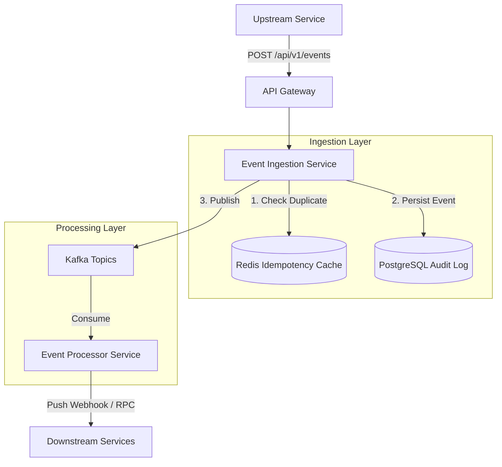

# Distributed Backend System Architecture: Microservices Event Engine

## 1. Overview
The **Microservices Event Engine** is a distributed backend platform designed to ingest, process, store, and route events asynchronously across various decoupled microservices. It acts as the central nervous system of the platform, enabling loose coupling between services while guaranteeing high availability, durability, and fault tolerance.

## 2. Responsibilities
- **Event Ingestion**: Expose high-throughput HTTP/gRPC APIs for upstream services to publish events.
- **Idempotency**: Prevent duplicate processing of the same event using caching mechanisms.
- **Validation**: Ensure all incoming events conform to predefined JSON schemas.
- **Persistence**: Store a durable, immutable audit log of all events.
- **Routing & Delivery**: Publish validated events to message queues and route them to designated downstream subscribers based on event topics.

## 3. Architecture
The architecture follows an event-driven microservices pattern ready for Docker containerization and Kubernetes orchestration.



## 4. Data Models

### postgresql_audit_log
The relational model to persist events durably in PostgreSQL.

| Column Name      | Data Type    | Constraints                  | Description                               |
|------------------|--------------|------------------------------|-------------------------------------------|
| `event_id`       | UUID         | PRIMARY KEY                  | Unique identifier for the event.          |
| `idempotency_key`| VARCHAR(255) | UNIQUE INDEX                 | Client-provided token to prevent retries. |
| `event_type`     | VARCHAR(100) | INDEX                        | The type of event (e.g., `user.created`). |
| `payload`        | JSONB        | NOT NULL                     | The complete event data.                  |
| `published_at`   | TIMESTAMPTZ  | DEFAULT NOW()                | When the event was received.              |
| `status`         | VARCHAR(50)  | DEFAULT `pending`            | `pending`, `published`, `failed`          |

### redis_idempotency_cache
Key-Value store mapping `idempotency_key` (e.g., `idemp:user.created:12345`) to `event_id`. Keys expire after 24 hours (TTL).

## 5. APIs or Interfaces

### **Ingest Event Interface**
`POST /api/v1/events`

**Headers:**
- `Idempotency-Key` (String, Required): UUID or robust unique hash.
- `Authorization` (String, Required): Bearer JWT.

**Request Body:**
```json
{
  "event_type": "order.checkout_completed",
  "version": "1.0",
  "data": {
    "order_id": "ord_12345",
    "customer_id": "cust_9876",
    "total_amount_cents": 25000
  }
}
```

**Response (202 Accepted):**
```json
{
  "event_id": "evt_abc123456",
  "status": "accepted"
}
```

## 6. Workflows

### **Event Ingestion Workflow**
1. **Receive HTTP Request**: The API Gateway validates the JWT and routes the request to the *Ingestion Service*.
2. **Idempotency Check**: The service queries Redis to see if `Idempotency-Key` exists.
   - If **yes**, return `200 OK` with the existing `event_id` to avoid processing it again.
3. **Schema Validation**: Validate the `event_type` and `data` payload against a centrally managed schema registry.
4. **Persistence (Outbox Pattern)**: Insert the event into the PostgreSQL `audit_log` with status `pending`.
5. **Publish**: Produce the event to the appropriate Kafka Topic based on `event_type` (e.g., `orders_topic`).
6. **Acknowledge**: Update PostgreSQL status to `published` and return `202 Accepted` to the client.

## 7. Edge Cases
- **Duplicate Requests**: Handled seamlessly by the Redis idempotency cache and Postgres UNIQUE constraint on `idempotency_key`. Race conditions are prevented by Redis `SETNX`.
- **Database Unavailability**: If PostgreSQL is down, the Ingestion Service rejects the request immediately with a `503 Service Unavailable` to allow the upstream client to handle retries.
- **Unrecognized Event Types**: Automatically rejected with `400 Bad Request` prior to database insertion.
- **Poison Pills**: Malformed data on the topic. Handled by rigorous JSON schema validation before publishing.
- **Large Payloads**: API Gateway enforces a hard limit of 1MB per event to protect Kafka partition size limits.

## 8. Performance Considerations
- **Connection Pooling**: Use PgBouncer or a built-in connection pooler to handle high concurrent inserts to PostgreSQL.
- **Kafka Batching**: Configure Kafka Producers to use `linger.ms=5` and `batch.size=32768` to optimize throughput over latency if acceptable.
- **Redis TTL**: Ensure idempotency keys expire (e.g., 24 hours) to prevent Redis memory exhaustion.
- **JSONB Indexing**: Utilize GIN indices on PostgreSQL `payload` column carefully to avoid insert degradation; only index fields queried frequently.
- **Horizontal Scaling**: The Event Ingestion Service is explicitly stateless (beyond Redis/Postgres state) to allow rapid Kubernetes HPA (Horizontal Pod Autoscaler) scaling.

## 9. Security Considerations
- **Authentication**: All APIs require a valid OIDC/JWT token validated by the API Gateway.
- **Encryption**: TLS 1.3 for all traffic at rest and in transit.
- **Kafka mTLS & ACLs**: Kafka brokers require mTLS for service-to-service communication to ensure only authorized producers can write to specific topics.
- **Data Subject Privacy**: PII data must be encrypted upstream or dynamically obfuscated before persistence in PostgreSQL.

## 10. Observability
- **Metrics**: Expose `/metrics` (Prometheus) on all microservices measuring HTTP request latency, Redis hits/misses, database connection pool utilization, and Kafka publish success rates.
- **Tracing**: Implement OpenTelemetry distributed tracing. Inject `trace_id` and `span_id` into Kafka message headers to trace requests from ingestion through processing.
- **Logging**: Output structured JSON logs to `stdout` for aggregation by FluentBit pipeline into ElasticSearch or Grafana Loki.

## 11. Failure Handling
- **Kafka Outage**: System uses the *Transactional Outbox Pattern*. If Kafka is down, events remain as `pending` in PostgreSQL. A dedicated asynchronous background worker (or Debezium Source Connector) continuously attempts to publish pending events with exponential backoff.
- **Downstream Consumer Failures**: If a downstream service fails to process an event from Kafka, the Event Processor writes the event back to a Dead Letter Queue (DLQ) topic for manual inspection or delayed automated retry mechanisms.
- **Circuit Breaking**: Implement circuit breakers around calls to Redis and Postgres to prevent resource exhaustion and fast-fail during partial network outages.
- **Graceful Shutdown**: Microservices intercept SIGTERM signals to complete in-flight HTTP requests and flush Kafka publisher buffers before Kubernetes terminates the pod.
